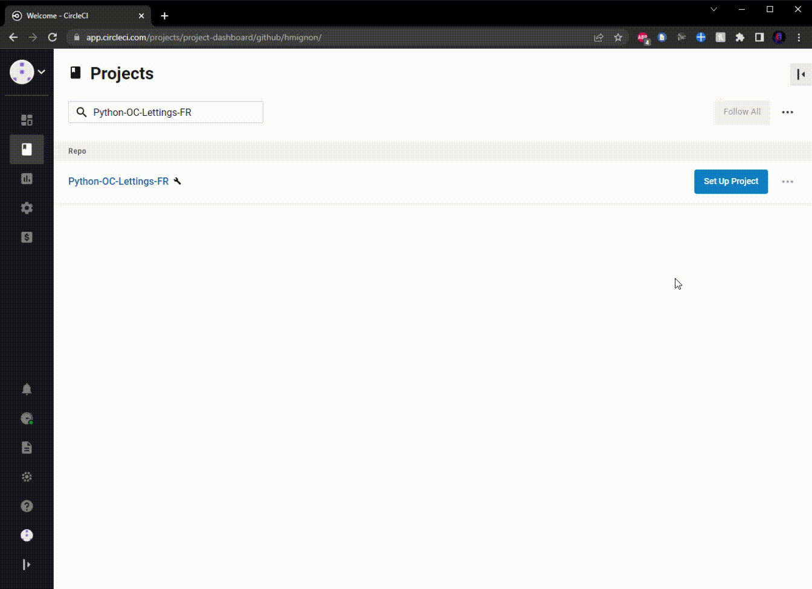
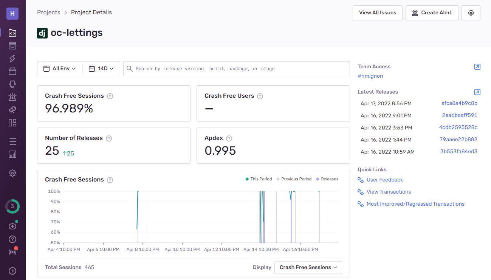

<!--suppress HtmlUnknownAnchorTarget, HtmlDeprecatedAttribute -->
<p align="center">
  
  
</p>

<p align="center">
  <a href="https://www.python.org">
    
  </a>
  <a href="https://www.djangoproject.com">
    
  </a>
  <a href="https://app.circleci.com/pipelines/github/hmignon/Python-OC-Lettings-FR">
    
  </a>
  <a href="https://www.docker.com">
    
  </a>
  <a href="https://oc-lettings-mignonh.herokuapp.com/">
    
  </a>
</p>

---

** [English documentation](README.en.md)**

---
## Accès rapide
#### 1. [Objectifs](#objectifs)
#### 2. [Développement local](#dev)
#### 3. [Déploiement](#deploiement)

---

<a name="objectifs"></a>
# Objectifs 
**Livrable P13 OC D-A Python : Mettre à l'échelle une application Django en utilisant une architecture modulaire**

_Testé sous Windows 10 - Python 3.9.5 - Django 3.0_

Plusieurs domaines du site **OC Lettings** ont été améliorés à partir du projet
[Python-OC-Lettings-FR](https://github.com/OpenClassrooms-Student-Center/Python-OC-Lettings-FR) :

1) Réduction de la dette technique

   - Corriger les erreurs de linting
   - Corriger la pluralisation des noms de modèles dans le site d'administration


2) Refonte de l'architecture modulaire

   - Créer 3 applications *lettings*, *profiles* et *home* pour séparer les fonctionnalités de l'application
   - Convertir *oc_lettings_site* en projet Django
   - Développer une suite de tests


3) Ajout d'un pipeline CI/CD avec [CircleCI](https://circleci.com) et déploiement sur [Heroku](https://www.heroku.com)

   1) *Compilation* : exécuter le linting et la suite de tests (sur toutes les branches)
   2) *Conteneurisation* : construire et push une image du site avec [Docker](https://www.docker.com) (si étape i. réussie, branche *master* uniquement)
   3) *Déploiement* : mettre en service le site avec Heroku (si étape ii. réussie, branche *master* uniquement)


4) Surveillance de l'application et suivi des erreurs via [Sentry](https://sentry.io/welcome/)

### Liens rapides :
- **[Pipeline CircleCI de ce projet](https://app.circleci.com/pipelines/github/hmignon/Python-OC-Lettings-FR)**
- **[Images Docker disponibles](https://hub.docker.com/r/mignonh/oc_lettings/tags)**
- **[Application déployée sur Heroku](https://oc-lettings-mignonh.herokuapp.com)**
- **[Exemple d'erreur sur Sentry](https://sentry.io/share/issue/0d3464c341cb4269809496e18d7c78aa/)**

<a name="dev"></a>
# Développement local

## Prérequis

- Compte GitHub avec accès en lecture à ce repository
- Git CLI
- SQLite3 CLI
- Interpréteur Python, version 3.6 ou supérieure

Dans le reste de la documentation sur le développement local, il est supposé que la commande `python` de votre OS shell 
exécute l'interpréteur Python ci-dessus (à moins qu'un environnement virtuel ne soit activé).

## Cloner le repository

- `cd /path/to/put/project/in`
- `git clone https://github.com/hmignon/Python-OC-Lettings-FR.git`

## Créer l'environnement virtuel

- `cd /path/to/Python-OC-Lettings-FR`
- `python -m venv venv`
- `apt-get install python3-venv` (Si l'étape précédente comporte des erreurs avec un paquet non trouvé sur Ubuntu)
- Activer l'environnement virtuel `source venv/bin/activate` (MacOS et Linux) ou `venv\Scripts\activate` (Windows)
- Confirmer que la commande `python` exécute l'interpréteur Python dans l'environnement virtuel
`which python` (MacOS et Linux) ou `(Get-Command python).Path` (Windows)
- Confirmer que la version de l'interpréteur Python est la version 3.6 ou supérieure `python --version`
- Confirmer que la commande `pip` exécute l'exécutable pip dans l'environnement virtuel, `which pip` (MacOS et Linux) ou `(Get-Command pip).Path` (Windows)
- Pour désactiver l'environnement, `deactivate`

<a name="env"></a>
## Variables d'environnement : fichier *.env*
Pour générer un fichier *.env* à compléter, lancer le script `python setup_env.py`.

Exemple de fichier *.env* généré :

```
DJANGO_SECRET_KEY=j%yuc7l_wwz5t8d=g)zxh6ol@$7*lwx6n0p)(k$dewlr0hf2u-
SENTRY_DSN= 
DEBUG=
```

Vous pouvez modifier le fichier en ajoutant :
- l'URL du projet Sentry après `SENTRY_DSN=` (vide par défaut, voir [Sentry](#sentry))
- `DEBUG=0` (*False*) ou `DEBUG=1` (*True*) (*False* par défaut)

## Exécuter le site

- `cd /path/to/Python-OC-Lettings-FR`
- `source venv/bin/activate` (MacOS et Linux) ou `venv\Scripts\activate` (Windows)
- `pip install --requirement requirements.txt`
- Effectuer les migrations `python manage.py migrate`
- Charger les données initiales `python manage.py loaddata data.json`
- Lancer le serveur `python manage.py runserver`
- Aller sur http://127.0.0.1:8000/ dans un navigateur.
- Confirmer que le site fonctionne et qu'il est possible de naviguer (vous devriez voir plusieurs profils et locations).

## Linting

- `cd /path/to/Python-OC-Lettings-FR`
- `source venv/bin/activate` (MacOS et Linux) ou `venv\Scripts\activate` (Windows)
- `flake8`

## Tests unitaires

- `cd /path/to/Python-OC-Lettings-FR`
- `source venv/bin/activate` (MacOS et Linux) ou `venv\Scripts\activate` (Windows)
- `pytest`

## Base de données

- `cd /path/to/Python-OC-Lettings-FR`
- Ouvrir une session shell `sqlite3`
- Se connecter à la base de données `.open oc-lettings-site.sqlite3`
- Afficher les tables dans la base de données `.tables`
- Afficher les colonnes dans le tableau des profils, `pragma table_info(oc_lettings_site_profile);`
- Lancer une requête sur la table des profils, `select user_id, favorite_city from oc_lettings_site_profile where favorite_city like 'B%';`
- `.quit` pour quitter

## Site d'administration

- Aller sur http://127.0.0.1:8000/admin/
- Connectez-vous avec l'utilisateur `admin`, mot de passe `Abc1234!`

## Docker

### Lancement de l'application en local via la création d'une image Docker
- Télécharger et installer [Docker](https://docs.docker.com/get-docker/)
- Naviguer vers le répertoire du projet `cd /path/to/Python-OC-Lettings-FR`
- Confirmer que le fichier *.env* nécessaire a bien été créé (voir [Variables d'environnement](#env))
- Créer l'image `docker build -t <image-name> .` avec le nom de votre choix
- Utiliser la commande `docker run --rm -p 8080:8080 --env-file .env <image-name>`, en remplaçant *image-name* par le nom de l'image créée

Vous pouvez accéder à l'application dans un navigateur via http://127.0.0.1:8080/


### Lancement de l'application en local via l'utilisation d'une image sur DockerHub
- Télécharger et installer [Docker](https://docs.docker.com/get-docker/)
- Aller sur le repository Docker : https://hub.docker.com/r/mignonh/oc_lettings/tags
- Copier le tag de l'image de votre choix (de préférence le plus récent)
- Utiliser la commande `docker run --rm -p 8080:8080 mignonh/oc_lettings:<image-tag>`, en remplaçant *image-tag* par le tag de l'image souhaitée

Vous pouvez accéder à l'application dans un navigateur via http://127.0.0.1:8080/


<a name="deploiement"></a>
# Déploiement

## Prérequis
Afin d'effectuer le déploiement et l'intégration continue de l'application, les comptes suivants sont nécessaires :

- compte [GitHub](https://github.com/)
- compte [CircleCI](https://circleci.com) (connecté au compte GitHub)
- compte [Docker](https://www.docker.com)
- compte [Heroku](https://www.heroku.com)
- compte [Sentry](https://sentry.io/welcome/)


## Description
Le déploiement de l'application est automatisé par un pipeline CircleCI. 
Lorsque l'on push des modifications sur le repository GitHub, le pipeline déclenche l'exécution des tests et du linting du code. 
Ces opérations sont effectuées sur **toutes les branches du projet**.

Si des modifications sont apportées à la **branche master**, et **si et seulement si** les tests et le linting sont réussis,
les opérations suivantes sont déclenchées :
- Création d'une image Docker et dépôt sur DockerHub
- **Si et seulement si** l'étape précédente est réussie, déploiement de l'application sur Heroku


## Configuration

### CircleCI

Après avoir récupéré le projet, mis en place l'environnement de développement local (voir [Développement local](#dev))
et créé les comptes requis, initialiser un projet sur CircleCI via *"Set Up Project"*. 
Sélectionner la branche *master* comme source pour le fichier *.circleci/config.yml*.

<p align="center">
    
    <em>Configuration CircleCI</em>
</p>

Pour faire fonctionner le pipeline CircleCI, il est nécessaire de préciser des variables d'environnement (*Project Settings* > *Environment Variables*) :

| Variable CircleCI | Description                                                                                                                                                                                                               |
|-------------------|---------------------------------------------------------------------------------------------------------------------------------------------------------------------------------------------------------------------------|
| DJANGO_SECRET_KEY | Clé secrète Django : générer une clé aléatoire avec [Djecrety](https://djecrety.ir) ou via la commande <br/> `python -c 'from django.core.management.utils import get_random_secret_key; print(get_random_secret_key())'` |
| SENTRY_DSN        | URL du projet Sentry (voir [Sentry](#sentry))                                                                                                                                                                             |
| DOCKER_LOGIN      | Nom d'utilisateur du compte Docker                                                                                                                                                                                        |
| DOCKER_PASSWORD   | Mot de passe du compte Docker                                                                                                                                                                                             |
| DOCKER_REPO       | Nom du repository sur DockerHub                                                                                                                                                                                           |
| HEROKU_APP_NAME   | Nom de l'application Heroku : l'application déployée sera accessible via `https://<HEROKU_APP_NAME>.herokuapp.com/`                                                                                                       |
| HEROKU_TOKEN      | Token Heroku, disponible dans les paramètres du compte (*Heroku API Key*)                                                                                                                                                 |


### Docker

Créer un repository sur DockerHub. Le nom du repository doit correspondre à la variable *DOCKER_REPO* définie pour CircleCI.

Le workflow de CircleCI va créer et déposer l'image de l'application dans le repository DockerHub défini. 
Il tague les images avec le “hash” de commit CircleCI (*$CIRCLE_SHA1*).

### Heroku

Pour créer une application dans votre compte Heroku, plusieurs options sont possibles :

- **Option 1 :** Créer manuellement l'application sur le site. Le nom de l'application doit correspondre à la variable *HEROKU_APP_NAME* définie pour CircleCI. 
Installer l'addon [Heroku Postgres](https://elements.heroku.com/addons/heroku-postgresql) pour cette application.


- **Option 2 :** Installer [Heroku CLI](https://devcenter.heroku.com/articles/heroku-cli#install-the-heroku-cli). Utiliser la 
commande `heroku apps:create <app-name> --region eu --addons=heroku-postgresql` avec le nom d'application de votre choix. 
Le nom d'application doit correspondre à la variable *HEROKU_APP_NAME* définie pour CircleCI.


- **Option 3 :** Modifier la configuration du pipeline CircleCI pour le premier commit > éditer le fichier *[.circleci/config.yml](.circleci/config.yml)* 
en ajoutant la ligne de commande à la place de *"paste command line here"* comme suit :

  - Pour créer une nouvelle application de zéro avec l'addon Heroku Postgres :

   `HEROKU_API_KEY=${HEROKU_TOKEN} heroku apps:create $HEROKU_APP_NAME --region eu --addons=heroku-postgresql`

  - Pour ajouter l'addon Heroku Postgres à une application existante : 

   `HEROKU_API_KEY=${HEROKU_TOKEN} heroku addons:create heroku-postgresql -a $HEROKU_APP_NAME --confirm $HEROKU_APP_NAME`

   **Note : Si votre application est déjà créée avec l'addon Heroku Postgres, il n'est pas nécessaire de modifier la configuration.**

   Le premier workflow CircleCI se chargera de créer l'application / ajouter l'addon Postgres automatiquement. 
**Veillez à supprimer la ligne de commande ajoutée dans *[.circleci/config.yml](.circleci/config.yml)* pour les futurs commits.**


<a name="sentry"></a>
### Sentry

Après avoir créé un compte [Sentry](https://sentry.io/welcome/), créer un projet pour la plateforme Django. Le SENTRY_DSN sera disponible
dans *Project Settings > Client Keys (DSN)*. Veillez à ajouter cette variable à CircleCI et dans le fichier *.env*.

<p align="center">
    
    <em>Dashboard Sentry</em>
</p>

La journalisation Sentry peut être testée en naviguant vers `/sentry-debug/`, localement (avec `runserver` ou une image Docker) et sur l'application déployée
via `https://<HEROKU_APP_NAME>.herokuapp.com/sentry-debug/`. 
Ce point de terminaison provoque une *ZeroDivisionError* ([exemple](https://sentry.io/share/issue/0d3464c341cb4269809496e18d7c78aa/)).